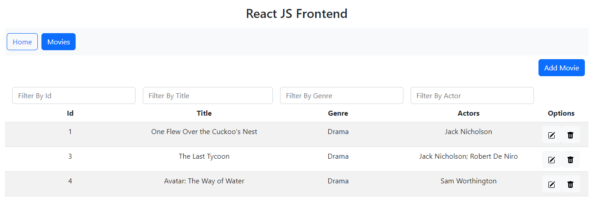

# Movies WebAPI + React UI Viewer  
The application contains backend and frontend parts. The backend part is implemented using .NET 6 + Entity Framework Core (ORM) + MS SQL Server (database).

## WebAPI contains two methods:
### `GET api/movie`
Getting a list of all the movies recorded in the database in JSON format. For example:

    [
        {
            "MovieId": 1,
            "Title": "One Flew Over the Cuckoo's Nest",
            "Genre": "Drama",
            "Actors": "Jack Nicholson"
        },
        {
            "MovieId": 3,
            "Title": "The Last Tycoon",
            "Genre": "Drama",
            "Actors": "Jack Nicholson; Robert De Niro"
        }
    ]
### `POST api/movie`
Adding movie information to the database. Information about the movie is sent in the request body in JSON format. For example:
    
    {
        "Title": "There Will Be Blood",
        "Genre": "Drama",
        "Actors": "Al Pacino;Marlon Brando"
    }

To test the API, you can use Postman Request Collection (see [PostmanRequestCollection](https://github.com/vadimartyushenko/MoviesWebAPI.EF/blob/master/PostmanRequestCollection/MoviesAPI.postman_collection.json)).

DB for test see in /DB folder.

## UI

The frontend part is implemented using React and Bootstrap library. The application allows you to filter information about movies by a given title, genre, actors and record ID. 

Added blanks for buttons that allow you to add, change or delete data through the UI (BUT binding to the corresponding API methods is not yet implemented!)

